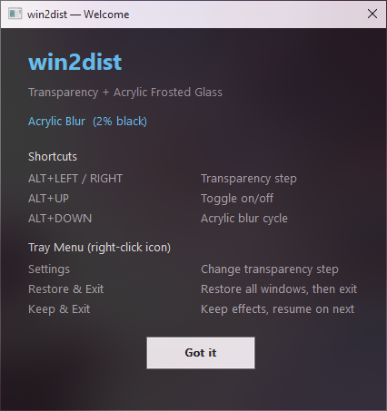

# win2dist

Real-time window transparency + Acrylic frosted glass for Windows 10/11.

Zero flicker. Zero dependencies. No admin privileges.

<p align="center">
  
</p>

## How it Works

```
Top:    Target window (semi-transparent via SetLayeredWindowAttributes)
Middle: Acrylic overlay (our native C++ window, DWM compositor blur)
Bottom: Desktop background
       → You see through the window at a blurred background = frosted glass
```

Everything happens inside the DWM compositor — no DLL injection, no symbol
hijacking, no flicker. The acrylic overlay sits directly below your window
in the z-order stack and blurs whatever is behind it.

## Features

- **Per-window transparency** — real-time control with global hotkeys
- **Acrylic blur** — native Windows Acrylic effect, zero-flicker
- **Session restore** — keep your effects across restarts
- **Portable** — single `.exe`, copy-and-run, no installation
- **180 Hz smooth** — overlay tracks window movement at your display's refresh rate

## Shortcuts

| Hotkey | Action |
|--------|--------|
| `ALT + ←` | More transparent (-step%) |
| `ALT + →` | Less transparent (+step%) |
| `ALT + ↑` | Toggle transparency on/off |
| `ALT + ↓` | Toggle Acrylic blur (2% black tint) |

## Tray Menu (right-click icon)

| Option | What it does |
|--------|-------------|
| **Settings** | Change the transparency step size (1–20%) |
| **Restore && Exit** | Undo all effects, then quit |
| **Keep && Exit** | Leave effects active, auto-restore on next launch |

## Requirements

- **Windows 10** version 1803 or later (Windows 11 supported)
- No admin privileges needed
- No external dependencies

## Download

Get the latest `win2dist.exe` from the [Releases](../../releases) page.

The single `.exe` bundles everything — Python runtime, native C++ overlay,
acrylic engine. ~11 MB, portable.

## Build from Source

```bash
# Prerequisites: Python 3.12+, MinGW-w64 (g++), CMake

# Build native helpers
cd native
mkdir build && cd build
cmake -G "MinGW Makefiles" ..
cmake --build .

# Run in dev mode
cd ../..
python main.py

# Package with PyInstaller
pip install pyinstaller
pyinstaller --onefile --noconsole --name win2dist \
  --add-data "acrylic_overlay.exe;." \
  --add-data "welcome_demo.exe;." \
  main.py
```

## Architecture

```
12window2clear/
├── main.py                  # Entry point → tray_app
├── window2clear/
│   ├── tray_app.py          # System tray + global hotkeys
│   ├── blur_controller.py   # Programmatic blur API
│   ├── frosted_glass.py     # Acrylic overlay launcher
│   └── diagnose.py          # DWM pipeline diagnostic
├── native/src/
│   ├── acrylic_overlay.cpp  # Zero-flicker acrylic window (C++ Win32)
│   └── welcome_demo.cpp     # Startup welcome + effect demo
└── dist/
    └── win2dist.exe         # Release binary
```

### Routes (how we explored the problem space)

| Route | Method | Flicker | Blur radius | Status |
|-------|--------|---------|-------------|--------|
| **A — Transparency** | `SetLayeredWindowAttributes` | zero | N/A | ✅ Production |
| **C — Acrylic Overlay** | Own DWM acrylic window behind target | zero | system-fixed | ✅ Production |
| E — DDA Capture | Desktop Duplication + GPU blur | 1 frame | custom | ⚠️ Experimental |
| F — DWM Hook | DLL injection + MinHook | zero | custom | ❌ PDB blocked |

## Roadmap

What we'd like to add in future releases:

- [ ] **Customizable blur radius** — currently fixed by DWM (~30px). Possible
  via DWM hook injection (Route F) once PDB symbol compatibility improves.
- [ ] **Background contrast/saturation boost** — enhance colors behind
  the blur for a richer frosted glass look. Requires Route E (DDA capture)
  with our own Gaussian blur shader.
- [ ] **Per-region blur masks** — different blur radii across different
  areas of the window, creating a fluid gradient effect.
- [ ] **Multi-monitor DPI awareness** — proper scaling on mixed-DPI setups.
- [ ] **Tint profiles** — save and switch between tint presets via hotkey.

## Acknowledgments

This project builds on the ideas and code of these open-source projects:

- **[DWMBlurGlass](https://github.com/Maplespe/DWMBlurGlass)** by **Maplespe**
  — Pioneered the DWM injection technique for custom blur effects on Windows
  10/11. We studied its MinHook-based interception of
  `CRenderingTechnique::ExecuteBlur` and `CCustomBlur::BuildEffect`
  extensively. The zero-flicker acrylic overlay approach in win2dist (Route
  C) was developed as a non-injection alternative after encountering PDB
  symbol incompatibility with certain Windows builds.

- **[Window2Clear](https://github.com/Blinue/Window2Clear)** by **Blinue**
  — A lightweight window transparency tool for Windows. Inspired our per-window
  `SetLayeredWindowAttributes` approach (Route A) and the system-tray +
  global-hotkey interaction model. Our project was originally named after
  this one — renamed to *win2dist* to avoid confusion.

Thank you to both authors for their excellent work.

## FAQ

**Why not use DWMBlurGlass?**
DWMBlurGlass is a great project, but we had compatibility issues with
certain Windows builds. win2dist takes a simpler approach: instead of
injecting into `dwm.exe`, we insert our own acrylic window behind the
target. Same visual result, zero compatibility headaches.

**Does it work with everything?**
Yes — any standard Win32 window (Notepad, Obsidian, VS Code, browsers,
etc.). Some UWP apps with custom title bars may not respond to
transparency changes.

**Is it safe? Will it break my windows?**
`Restore && Exit` undoes everything. All effects are runtime-only — no
persistent system changes. The worst case: restart your computer and
everything is back to normal.

## License

MIT — see [LICENSE](LICENSE) for details.

---

*win2dist was originally named "Window2Clear" — renamed to avoid confusion
with the unrelated open-source project of the same name.*
